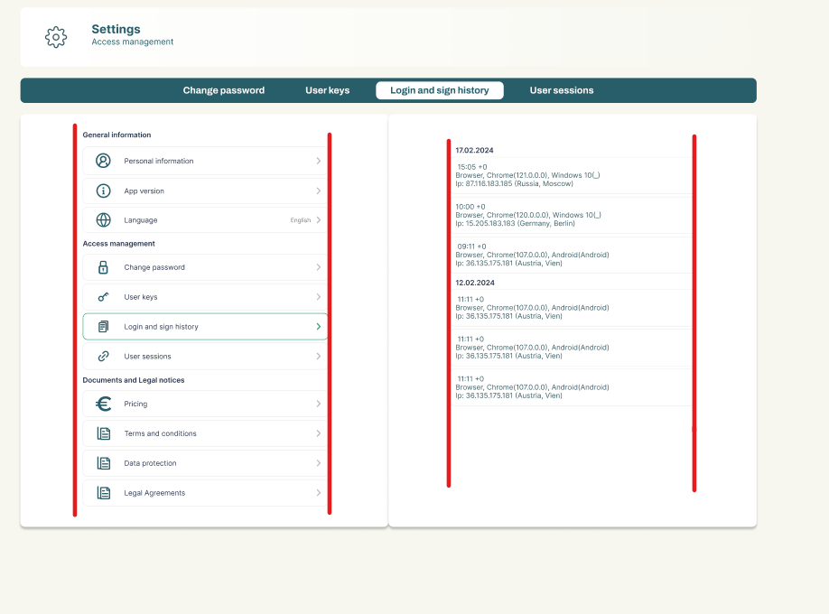
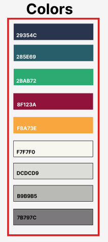

# Command Line Interface

_package.json_

```json
{
  "scripts": {
    "orval": "orval", // Generates api request functions
    "check": "tsc --noEmit && echo Done.", // Checks for typescript errors
    "lint": "eslint . --fix",
    "prettier": "prettier . --write",
    "prepare": "husky install",

    // Local scripts
    "local": "cross-env APP_TYPE=GEKKARD vite --mode dev.gekkard",
    "gko-local": "cross-env APP_TYPE=GEKKOIN vite --mode dev.gekkoin",
    "gkw-local": "cross-env APP_TYPE=GEKWALLET vite --mode dev.gekwallet",

    "DEV-GEKKARD": "node tsc && cross-env APP_TYPE=GEKKARD vite build --mode dev.gekkard",
    "DEV-GEKKOIN": "node tsc && cross-env APP_TYPE=GEKKOIN vite build --mode dev.gekkoin",
    "DEV-GEKWALLET": "node tsc && cross-env APP_TYPE=GEKWALLET vite build --mode dev.gekwallet",

    "STG-GEKKARD": "node tsc && cross-env APP_TYPE=GEKKARD vite build --mode stg.gekkard",
    "STG-GEKKOIN": "node tsc && cross-env APP_TYPE=GEKKOIN vite build --mode stg.gekkoin",
    "STG-GEKWALLET": "node tsc && cross-env APP_TYPE=GEKWALLET vite build --mode stg.gekwallet",

    "PRD-GEKKARD": "node tsc && cross-env APP_TYPE=GEKKARD vite build --mode prd.gekkard",
    "PRD-GEKKOIN": "node tsc && cross-env APP_TYPE=GEKKOIN vite build --mode prd.gekkoin",
    "PRD-GEKWALLET": "node tsc && cross-env APP_TYPE=GEKWALLET vite build --mode prd.gekwallet"
  }
}
```

## Архитектура ([Feature-Sliced Design](https://feature-sliced.design/ru/docs/get-started/overview))

Структура папок и файлов именуется в `kebab-case`, кроме `.tsx` (`PascalCase`);

#### Для статики используется `publicPath: "public"`. При указании абсолютного пути папка не учитывается _(прим. **``**)_

```
└── src/
    ├── app/
    ├── processes/
    ├── pages/
    ├── widgets/
    ├── features/
    └── shared
```


## Style Guide:
CSS - предпочтительный способ описания стилей и присвоения классов.

С меньшим приоритетом используется утилита [**tailwindcss**](https://tailwindcss.com/).

#### (cs) | (no-usages)

(cs) - [custom] - в начале имени файла или папки, говорит о кастомных изменениях сторонних зависимотей проекта. (_Прим.
(cs)axios.scss_)

#### .Class (:components using)

`styles.module.scss`

Стили импортируемые для отдельного компонента, сопровождается названию класса с большой буквы, при этом несвязанность модуля позволяет
брать более высокие абстракции,поэтому рекомендуется делать нейминг в одно слово. (_Прим. 'Title', 'First', 'Label' и др._)

## JavaScript Guid

`camelCase` stylized

См. документацию по [**React**](https://reactjs.org/docs/getting-started.html), [**TypeScript**](https://www.typescriptlang.org/docs/) (tsconfig.json)

## Docker Stage

Для стенда используется команда `npm run preview` и параллельно с этим на стороне сервера `.env.local` файл с переменной `VITE_DEV_DOCKER='true'`.

## State Manager ([Zustand](https://github.com/pmndrs/zustand))

    "zustand": "4.3.6"

Multi-storage который предусматривает опционально middleware:

    - persist;
    - devtools;
    - immer;

## Работа с датами ([Date-fns](https://date-fns.org/docs/Getting-Started))

date-fns предоставляет наиболее полный, но простой и последовательный набор инструментов для управления датами JavaScript в браузере и Node.js.

# Макеты

Все макеты указаны в [figma](https://www.figma.com/design/7XhDrrOtaeDNcMxxZPWhJ9/Gekkard-dev)

### Основные версии сайта

Основное разделение версий сайта - мобильная и десктопная версия:

| Метрика                                |    Mobile     | Desktop |
| -------------------------------------- |:-------------:|:-------:|
| Экран                                  | 320px - 768px | 768px+  |
| Основной шрифт (могут быть исключения) |     12px      |  14px   |

### Размер блоков
Размер блоков внутри подложек должен иметь размер **320px - 414px**:



### Цветовая гамма
Цветовая палитра приложения указана в [figma](https://www.figma.com/design/7XhDrrOtaeDNcMxxZPWhJ9/Gekkard-dev?node-id=170-257&t=S1bW6rJ0WOFI5opc-0), опираемся на неё во всех аспектах




# Развертывание на production

В связи с загрузки скриптов в /scr/app/init.ts по условию активной сессии и условиями кэширования, при обновлении production возможны запросы к старым версиям скриптов,
которых уже нет на сервере — это выливается в ошибки загрузки и зависания. Чтобы предотвратить такие проблемы для пользователей, мы можем перед выкладыванием на прод забирать
уже собранные файлы скриптов с web.gekkard.com и класть их в код, чтобы они были доступны на сервере. С учетом частоты обновлений и хранения в кэше index.html в течении месяца,
достаточно хранить 1-2 предыдущие версии.